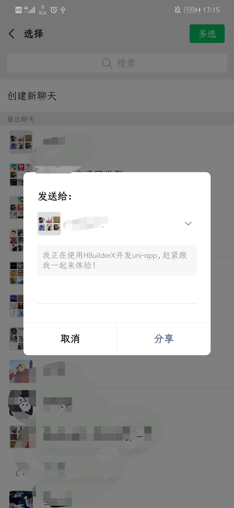
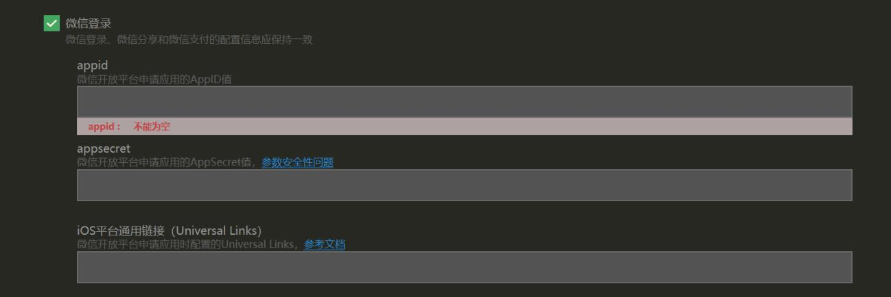
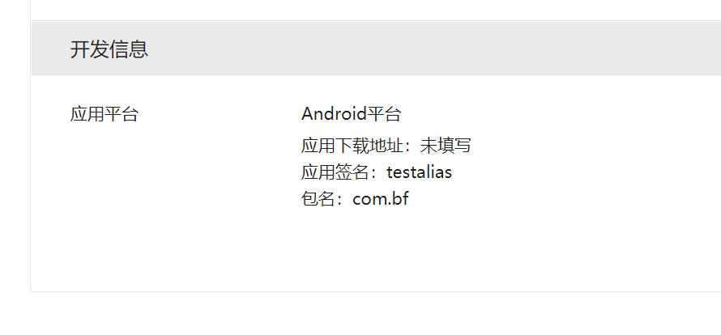
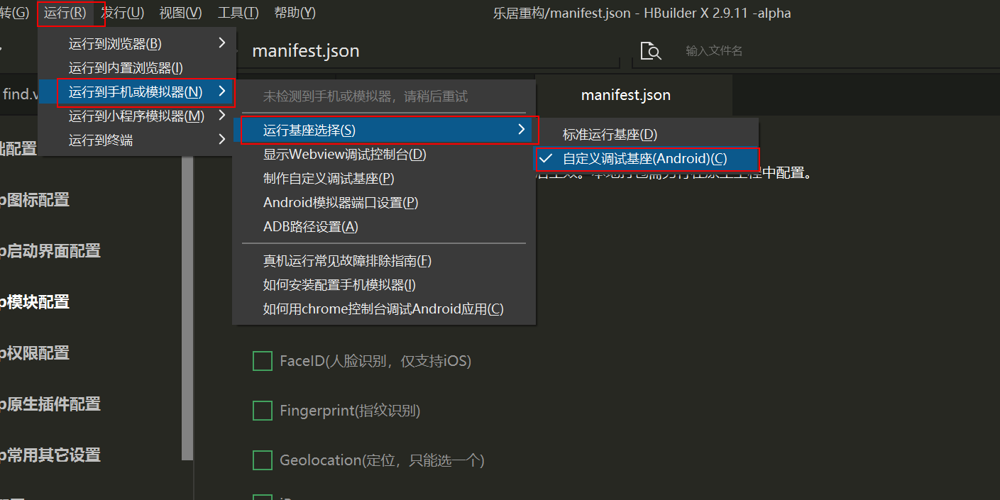
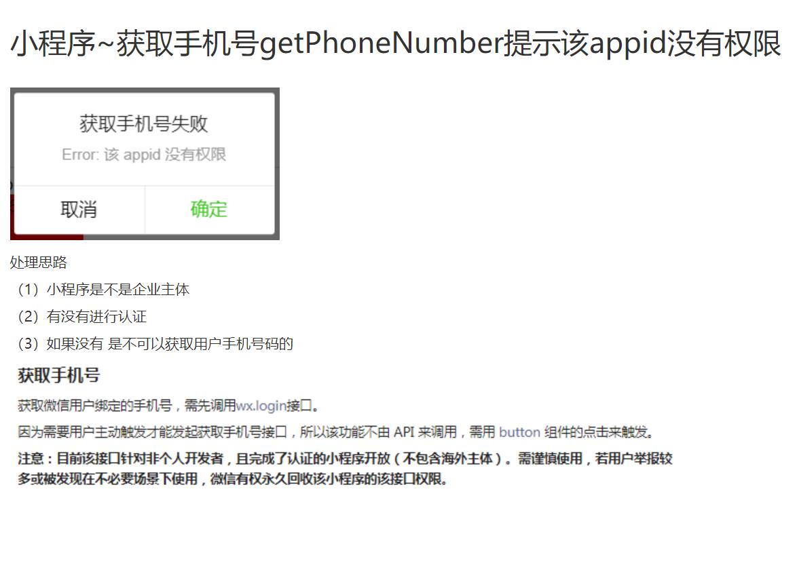
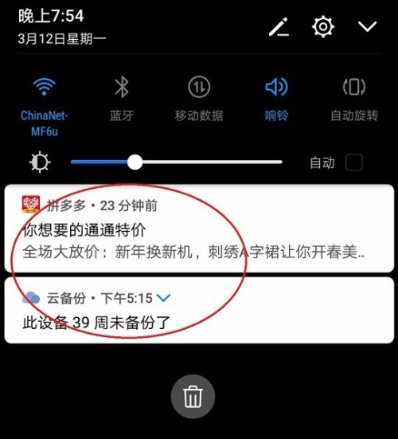
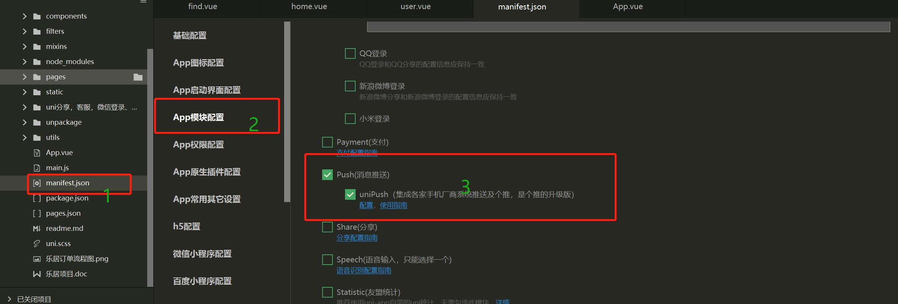
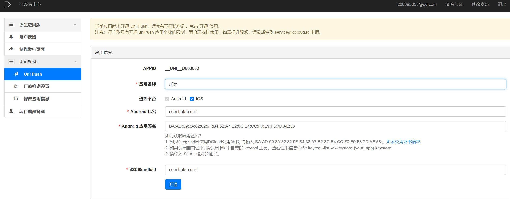

## 乐购

### [分享到小程序](https://uniapp.dcloud.io/api/plugins/share?id=onshareappmessage)




```js

//组件方式进行调用
<button type="default" open-type="share">分享</button>
// 与生命周期钩子同级
onShareAppMessage(){
		return {
			title:"乐居分享",
			path:"pages/find/find",
			imageUrl:"/static/icons/brand.png"
		}
	},
```

### [app分享准备条件](https://uniapp.dcloud.io/api/plugins/share?id=unishare-%e5%9c%a8app%e7%ab%af%e5%90%84%e7%a4%be%e4%ba%a4%e5%b9%b3%e5%8f%b0%e5%88%86%e4%ba%ab%e9%85%8d%e7%bd%ae%e8%af%b4%e6%98%8e)

### 小程序分享

```js
<button type="default" open-type="share"> 
			分享
		</button>


onShareAppMessage(res) {
			// 小程序分享指引 https://developers.weixin.qq.com/miniprogram/dev/framework/open-ability/share.html
		    if (res.from === 'button') {// 来自页面内分享按钮
		      console.log("按钮点击了")
		    }
		    return {
		      title: '自定义分享标题',
		      path: '/pages/index/index',
			  content:"分享内容",
			  imageUrl:"/static/logo.png"
		    }
		},
```


### [HBuilder基座和自定义基座](https://www.jianshu.com/p/b4b970011188)

### [客服](https://developers.weixin.qq.com/miniprogram/introduction/custom.html)

```js
<button class="leftBox" type="default" plain="true" open-type="contact" @contact="contact">
				<view class="left">
					<image src="../../static/icons/chat.png" mode=""></image>
				</view>
			</button>

```

[添加客服人员](https://jingyan.baidu.com/article/5553fa8283f46565a2393412.html)

### 微信登录

ios暂时不行(没有ios开发者账户，且项目暂时没有上线，所以ios微信登录暂不考虑)

首先必须去[微信开放平台](https://open.weixin.qq.com/cgi-bin/index?t=home/index&lang=zh_CN)申请appid及appsecret



#### [申请流程](https://developers.weixin.qq.com/doc/oplatform/Mobile_App/WeChat_Login/Development_Guide.html)

#### [申请地址](https://open.weixin.qq.com/)

ps：个人无法申请appid及appsecret  这里我们提供的有


#### 打包的时候 应用的包名改成 com.bf

ps：( 包名是你打包App时，自己填写的)

#### [证书](https://blog.csdn.net/jjxojm/article/details/81395573)




#### 测试的时候选择自定义基座



#### 代码部分

```js
<!-- #ifdef APP-PLUS -->
<view @tap="getUserInfo">微信登录获取个人微信头像及昵称</view>
<!-- #endif -->


getUserInfo(){
				var _this = this;
				// uni.getProvider获取服务供应商。在App平台，可用的服务商，是打包环境中配置的服务商，与手机端是否安装了该服务商的App没有关系。
				uni.getProvider({
					service:"oauth",
					success(res) {
						if(res.provider.includes("weixin")){ // 判断是否是微信
							uni.login({
								provider:"weixin",
								success(result) { // 登录成功
									uni.getUserInfo({ // 获取个人信息
										provider:"weixin",
										withCredentials:true, // 携带登录态信息
										lang:"zh_CN",
										success(res1) {
											console.log("获取的个人信息为",JSON.stringify(res1))
											_this.userInfo.nickname = res1.userInfo.nickName;
											_this.userInfo.icon = res1.userInfo.avatarUrl;
										},
										fail(res1) {
											uni.showToast({
												title:"获取个人信息失败",
												icon:"none"
											})
										}
									})
								},
								fail(result) {
									console.log("失败",JSON.stringify(result));
									uni.showModal({
										title:"失败",
										content:JSON.stringify(result)
									})
								},
							})
						}
					}
				})
			},

```

### 获取手机号

获取手机号仅针对企业用户的appid才能调用  个人调用不了

[小程序获取手机号文档](https://developers.weixin.qq.com/miniprogram/dev/framework/open-ability/getPhoneNumber.html)

[小程序加密及解密](https://developers.weixin.qq.com/miniprogram/dev/framework/open-ability/signature.html#%E5%8A%A0%E5%AF%86%E6%95%B0%E6%8D%AE%E8%A7%A3%E5%AF%86%E7%AE%97%E6%B3%95)



### [推送](https://uniapp.dcloud.io/api/plugins/push?id=app%e5%b9%b3%e5%8f%b0)


 是指从服务器主动给手机端发送消息

### 


1. 打开项目 勾选unipush

   

2. 点击配置 开通unipush

3. 后台开通

   包名时打包项目时所起的包名

   

4. 愉快的发送消息
5. 如需app离线也能发送消息，可以对接厂商如华为小米等

### [uni推送指南](https://ask.dcloud.net.cn/article/35716)